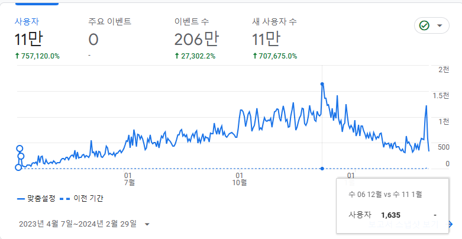
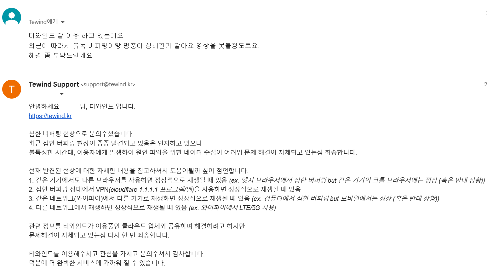
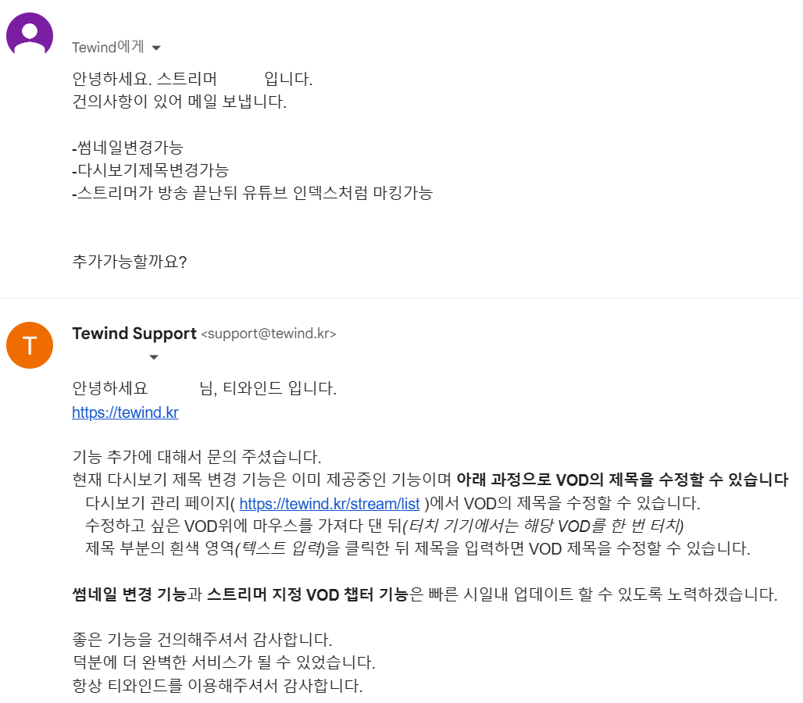
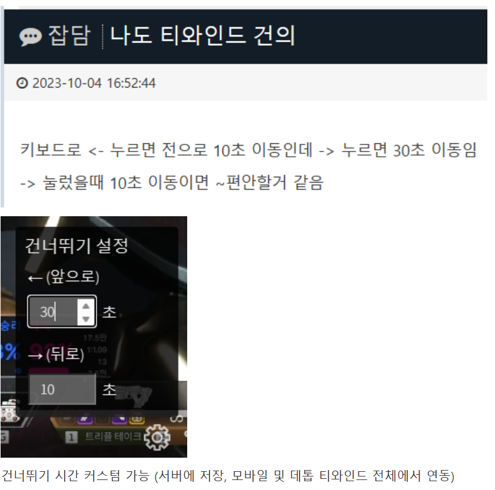

# tewind


**트위치 다시보기 서비스**

> ~~*https://tewind.kr*~~ *(서비스 종료)*  
**아카이브 링크**  
https://archive.md/XeCX6 *(메인페이지)*  
https://archive.md/https://tewind.kr/* *(모든페이지)*  
<br>
**2023.04 ~ 2024.02**

2022년 트위치 대한민국 내 VOD 콘텐츠 중단 사건으로 인해  
다시보기 제공이 중지됨에 따라 대체 서비스가 필요하다고 생각되어 개발, 서비스 운영  
  
트위치 방송이 시작되면 실시간으로 녹화해서 사용자에게 제공하는 영상 서비스

[ >> 서비스를 자세하게 알아볼 수 있는 **티와인드 매뉴얼**](https://www.notion.so/tewind/Te-wind-6098a12e569a48cb8a06d231b743ad20)
<br><br>

## 주요 실적
1. MAU 30,000명 이상 서비스 유지

<br><br>
2. 극한의 비용절감을 통해 저렴한 비용으로 서비스 제공 *(경쟁력 확보)*   
    |티와인드|타서비스 T|타서비스 R|
    |-|-|-|
    |7,700원|30,000원|25,000원|  
    <br>
3. 운영 기간중 서버 다운 0건  
백업 시스템 인프라를 구축하여 방송 녹화 안정성 확보  
<br>

> 약 **180명의 스트리머**의 **11,000여개의 방송** *(160TB 가량)* 을 안정적으로 문제없이 잘 녹화하고 이를 **19,000명 가량의 이용자** *(매일 1,500명의 활성 사용자)* 들에게 제공

<br>

## 스킬

```구독형 서비스``` ```카드 정기결제```  
```ffmpeg``` ```hls```  
```nodejs``` ```express``` ```mysql``` ```s3``` ```redis```  
```aws``` ```github action``` ```cloudflare/workers```  
```vanilla js/css```

<br>

## CS
1. 서비스에 대한 매뉴얼 작성  
[ >> **티와인드 매뉴얼**](https://www.notion.so/tewind/Te-wind-6098a12e569a48cb8a06d231b743ad20)


2. 서비스를 운영하면서 메일과 커뮤니티를 통해 받는 **사용자 문의나 기능 건의를 처리**
    - 사용자 입장에서 해당 오류를 이해할 수 있도록 설명, 최대한 빠른 복구 제공
    - 사용자들이 원하는 기능을 파악하여 빠른 피드백 *(업데이트)* 제공

<br>

### 각종 사례
#### - 오류 문의 케이스
  


#### - 기능 건의 케이스
  

  


#### - 힘이 나는 소소한 응원들
  
  

***프로젝트 원동력***

<br><br>
-----
<br>

# tewindApp
트위치 방송 녹화 서비스
> https://tewind.app  
2024.02 ~ *(유지 중)*

2024년 트위치 대한민국 사업 철수 사건으로 인해  
더이상 대한민국에서 트위치 다시보기 수요 전멸  
<br>
트위치 관련 모듈 *(녹화 및 썸네일 관련 로직)* 을 이대로 묻히기에는 아깝다고 생각해  
타겟 유저를 변경 *(해외의 스트리머 팬영상 제작자 및 클립퍼)* 하여 트위치 녹화 서비스로 재탄생

## 스킬

```구독형 서비스``` ```web push``` ```paypal```  
```ffmpeg``` ```hls```  
```nodejs``` ```express``` ```mysql``` ```s3``` ```redis```  
```aws``` ```github action``` ```cloudflare/workers```  
```vanilla js/css```